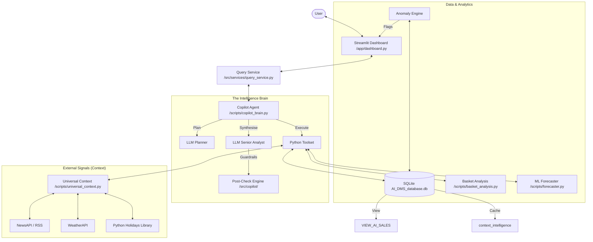

# 📖 The QAFFEINE Project : Bajaj DMS Intelligence Platform

This document serves as the absolute technical reference for the **Bajaj DMS Analytics & AI Copilot** (QAFFEINE). It details the database architecture, agentic reasoning loops, tool integration, and the end-to-end flow of data from raw sales records to AI-driven business insights.

---

## 1. System Connectivity Graph

---

## 2. Core Architecture: The Agentic Loop

QAFFEINE operates on a **"Plan → Execute → Synthesise"** pattern, designed to mimic a high-level Business Analyst.

### Phase 1: Planning (`_plan`)
The LLM (Gemini 1.5 Pro or Llama-3) receives the user query, the DB schema, and the Tool Registry.
*   **Temporal Anchor:** If the user mentions "today," the system hardcodes the context to **2026-01-31** (the latest data point).
*   **JSON Strategy:** It outputs a raw JSON array of tool calls.
*   **Multi-Step:** A single query like "Why did sales drop?" triggers a plan with SQL (actuals), SQL (baseline), Holiday check, and News check.

### Phase 2: Execution (`_execute`)
The `CopilotAgent` runs the tools sequentially.
*   **`query_sales_db`**: Executes SQL via a guarded execution layer (`src/sql/guarded_execute.py`).
*   **`get_holiday_status`**: First checks the `context_intelligence` table; if missing, calls the local library.
*   **`get_news_context`**: Retrieves pre-analysed LLM disruptor summaries from the DB or fetches live headlines.
*   **`analyze_product_mix`**: Runs a live Market Basket Analysis (Lift/Confidence) on the current filtered dataset.

### Phase 3: Synthesis & Hardening (`_synthesise`)
The LLM receives the raw tool results and applies **Intelligence Hardening** rules.
*   **Senior Analyst Voice:** No technical jargon (no mention of "SQL" or "Tools").
*   **Numeric Truth:** Every number must be sourced from a tool result.
*   **Crore Rule:** Automatic conversion of large figures to "Cr" (Ten Million) or "Lakh" (Hundred Thousand).

---

## 3. Trust & Integrity Guardrails (The "Hardening" Layer)

Located in `src/copilot/`, these modules ensure the AI doesn't hallucinate or mislead.

### A. Premise Correction (`premise_check.py`)
If a user asks "Why did sales drop on Jan 15th?", the system automatically ranks Jan 15th against all other days.
*   **The "Peak" Signal:** If Jan 15th was actually a **top-3 revenue day**, the AI is *forced* to start its response by correcting the user: *"Actually, January 15th was a high-performance day (Ranked #2 this month)..."*

### B. Numeric Verification (`numeric_postcheck.py`)
*   **Logic:** The system extracts every currency figure from the AI's final narrative.
*   **Total Check:** It compares the AI's mentioned "Total Revenue" against the actual `SUM(NET_AMT)` from the SQL tool.
*   **The Footer:** If the AI hallucinates a number (e.g., states ₹50L when the table shows ₹30L), a **Correction Footer** is automatically appended to the chat bubble.

### C. Causal Validation (`causal_postcheck.py`)
*   **Logic:** Detects causal language like *"because of the rain"* or *"due to the holiday"*.
*   **Integrity:** If the AI makes a causal claim but the Tool results didn't actually confirm that factor (e.g., weather was "Clear"), it appends a disclaimer: *"Causal links to weather are not proven by invoice tables alone."*

---

## 4. The Data Engine (Database Schema)

The platform relies on `AI_DMS_database.db`, featuring a high-performance flattened view.

### A. `VIEW_AI_SALES` (The Fact Engine)
*   **Financials:** `NET_AMT` (Revenue - **ALWAYS use SUM**), `GROSS_AMT`, `TAXABLE_AMT`.
*   **Discounts:** `SCHEME_AMT` (SKU Level), `GRP_SCHEME_AMT` (Basket Level).
*   **Hierarchy:** `ZONE`, `STATE`, `TOWN`, `ZONAL_HEAD`, `SALES_MANAGER`, `AREA_SALES_MANAGER`.
*   **Distribution:** `STOCKIEST` (Distributor), `BEAT` (Route), `CUSTOMER` (Retailer), `ISR` (Sales Rep).
*   **Product:** `PRODUCT_CLASS` (Category), `CODE` (Brand), `PRODUCT` (SKU), `PRODUCT_MRP`.
*   **Time:** `INVOICE_DATE` (Always filtered via `SUBSTR(INVOICE_DATE, 1, 10)`).

### B. `context_intelligence` (The Signal Cache)
*   `news_disruptors`: LLM-distilled business impact of the day's news.
*   `is_holiday`: Boolean flag for market closures.

---

## 5. Advanced Intelligence Components

*   **Anomaly Engine (`scripts/anomaly_engine.py`)**: Uses Statistical Z-Scores to flag revenue drops.
*   **Revenue Forecaster (`scripts/forecaster.py`)**: ML-based XGBoost model for "What-If" scenarios.
*   **Basket Analysis (`scripts/basket_analysis.py`)**: Computes **Lift**, **Confidence**, and **Support** for SKU bundles.

---

## 6. Directory & File Map

| Path | Responsibility |
| :--- | :--- |
| `app/dashboard.py` | UI Entry Point (Streamlit). |
| `scripts/copilot_brain.py` | Main Agent logic & Tool implementations. |
| `scripts/universal_context.py` | LLM Gateway & External Context (Weather/News). |
| `scripts/anomaly_engine.py` | Statistical outlier detection. |
| `scripts/forecaster.py` | Predictive ML modeling & Scenario parsing. |
| `src/services/` | Business logic bridge between UI and AI. |
| `src/copilot/` | **The Hardening Layer** (numeric_postcheck, premise_check, etc.). |
| `src/sql/` | Security layer for SQL generation and execution. |
| `src/data/access/db.py` | Thread-safe SQLite connection manager. |

---

**Document Status:** Comprehensive (Verified May 2026)  
**Maintained by:** QAFFEINE Intelligence Team (Antigravity AI)
