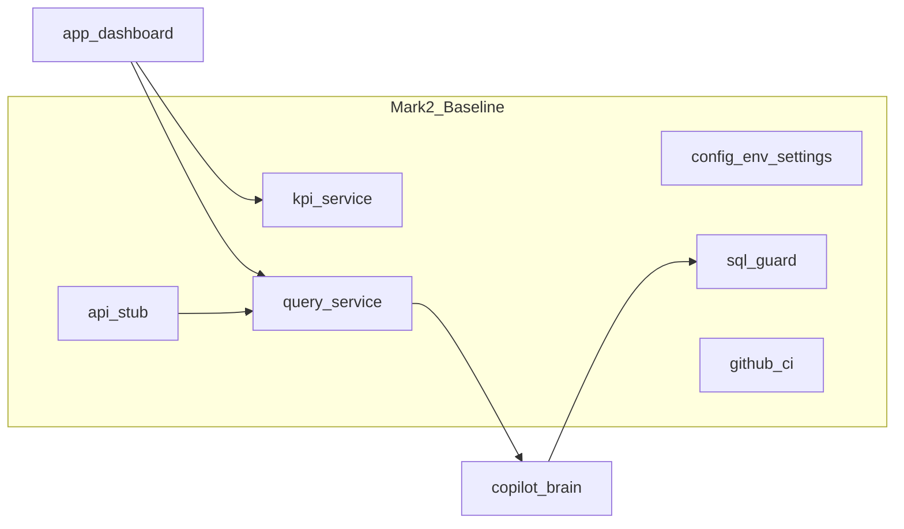

# Rebuild Mark II (canonical plan)

This document is the **version-controlled product roadmap** for `dailyassistant-copilot_rebase`. Use it as the single source of truth for what is done and what remains.

It **supersedes** earlier Cursor-only plans (master UI/production rebuild, UI subset, bootstrap/correctness). Keep those files for history if needed; **day-to-day work should trace to Mark II**.

---

## Baseline already in the repo (do not redo)

- **Env / DB:** [`src/config/env.py`](../src/config/env.py) `load_app_dotenv`; [`src/config/settings.py`](../src/config/settings.py) (Pydantic settings + `APP_DB_PATH`); [`src/config/runtime_check.py`](../src/config/runtime_check.py) startup DB file check; Streamlit wires validation in [`app/dashboard.py`](../app/dashboard.py).
- **KPI path:** Parameterized reads in [`src/services/kpi_service.py`](../src/services/kpi_service.py); dashboard KPI tab consumes it (no raw SQL in that tab).
- **Copilot path:** [`src/services/query_service.py`](../src/services/query_service.py) — singleton agent, `investigate_copilot_for_ui`, `run_copilot_query`; dashboard Copilot tab uses `st.chat_message` + service.
- **SQL guard (D2 precursor):** [`src/sql/sql_guard.py`](../src/sql/sql_guard.py) + use from [`scripts/copilot_brain.py`](../scripts/copilot_brain.py) `_tool_query_sales_db`.
- **Jarvis:** [`scripts/jarvis_brain.py`](../scripts/jarvis_brain.py) is a **shim** re-exporting Copilot — no duplicate agent logic.
- **UI shell:** Four tabs (KPI, Copilot, Notifications, Simulator); central CSS/tokens in [`src/app/styles.py`](../src/app/styles.py); plotly/dataframe `width="stretch"` where migrated; some `st.button(..., use_container_width=True)` may remain.
- **API stub:** [`src/api/main.py`](../src/api/main.py) — `GET /health`, `POST /v1/copilot/query`.
- **CI:** [`.github/workflows/ci.yml`](../.github/workflows/ci.yml) — pytest on `main` / `copilot_rebase`.
- **Docs present:** [setup.md](setup.md), [architecture.md](architecture.md).
- **Packaging:** [`pyproject.toml`](../pyproject.toml) + [`requirements.txt`](../requirements.txt) (Streamlit, pydantic, FastAPI, uvicorn, etc.).

---

## Mark II — remaining work (execution order)

### Track D — D1 close-out and D2 reliability

1. **D1 finish:** Remove remaining broad `except` on new paths where practical; ensure all UI-triggered subprocess/LLM paths have timeouts + user-safe errors; optional Pydantic validation for date/outlet bounds at service entry ([`src/services/kpi_service.py`](../src/services/kpi_service.py) extensions).
2. **D2 core:** Intent JSON schema + template SQL compiler + policy engine; feature flags `USE_GUARDED_SQL_PIPELINE` / `USE_NEW_COPILOT_ENGINE` (read from settings); replace default free-form LLM SQL in copilot with flagged cutover; `query_id` / latency logging; **golden-query** tests in CI.
3. **Fact-pack / premise:** Structured `evidence` (or nested object) on [`src/contracts/copilot.py`](../src/contracts/copilot.py) for “drop vs peak” class failures; minimal golden prompts.

### Track S — D3 structure and documentation

4. **`src/agents/`:** Move orchestration from [`scripts/copilot_brain.py`](../scripts/copilot_brain.py) behind `src/agents/copilot_engine.py` (scripts become thin CLI); keep shim until imports updated.
5. **Artifacts:** `var/` for logs/artifacts ([`.gitignore`](../.gitignore) mentions `var/`); migrate paths from `database/basket_results.json` / mailer logs where applicable.
6. **Lockfile:** `uv lock` or `pip-tools` — pick one team standard; document in setup.
7. **Missing docs (repo):** Add `docs/runbook.md`, `docs/data-dictionary.md`, `docs/llm-sql-policy.md`; optional `docs/GAP_ANALYSIS.md` (closed vs open gaps).
8. **`_one_off/`:** Inventory → fixtures / archive / delete (no hidden production imports).

### Track A — D4 and operations

9. **HTTP contracts:** Expand [`src/api/main.py`](../src/api/main.py) with KPI + job stubs; document routes in architecture.
10. **Cutover / rollback:** Short doc section in runbook (flags, smokes, rollback triggers).
11. **Load / SLO:** Baseline script or CI job artifact (defer if heavy).

### Track U — Streamlit UX (secondary)

12. **Deprecations:** Replace remaining `use_container_width` on widgets that support `width` in current Streamlit.
13. **Copilot UX:** Suggestion **pills/buttons** (replace HTML cards); optional `st.fragment` to reduce full reruns; truncate long `st.code` tool results.
14. **KPI / Notifications / Simulator:** Layout pass, Plotly theme tied to tokens, empty states; less raw HTML in notify/sim.
15. **Sidebar:** Tighten brief + demo; optional collapsible demo.
16. **Optional:** Split [`app/dashboard.py`](../app/dashboard.py) into `src/app/tabs/*.py` + shared styles import.

### Track W — workflow

17. **Branch discipline:** Feature branches off `copilot_rebase` / `main`; small PRs per track above.

---

## Success criteria (Mark II “done”)

- Single **intent-to-SQL** path on by default (legacy behind flag only for rollback window).
- **No** production business SQL in Streamlit; services + repositories only.
- **CI:** pytest + (optional) ruff/format + dashboard import smoke.
- **Docs:** setup + architecture + runbook + data-dictionary + llm-sql-policy in repo.
- **API:** Health + copilot + at least one read-only KPI endpoint (or documented stub parity with services).

---

## Checklist (Mark II implementation status)

- [x] D1 close-out: Copilot LLM **timeout**; **KpiTabQuery** validation on `load_kpi_tab_data` entry.
- [x] D2 (baseline): Intent → **template SQL** for `total_revenue`, `revenue_by_outlet`, `top_items`; flags **`USE_GUARDED_SQL_PIPELINE`**, **`USE_NEW_COPILOT_ENGINE`**, **`COPILOT_TIMEOUT_SECONDS`**; **golden** test `tests/test_intent_pipeline.py`; **`query_id`** + **`evidence`** on API DTO (intent path).
- [ ] D2 (stretch): Full JSON intent schema, richer policy engine, **evidence** for LLM-only answers, broader golden suite.
- [x] D3: **`src/agents/copilot_engine.py`**, **`legacy_adapter.py`**, `var/` basket preference, **`src/data/sidebar_bounds.py`**.
- [ ] D3 (stretch): Thin `scripts/` CLI only, committed **lockfile**, shrink `_one_off/` assets (README added).
- [x] D3 docs: **runbook**, **data-dictionary**, **llm-sql-policy**, **GAP_ANALYSIS**.
- [x] D4: **`GET /v1/kpi/revenue-total`**, **`POST /v1/jobs/morning-brief`** stub; runbook cutover/rollback.
- [ ] D4 (stretch): Load / SLO baseline job.
- [x] Track U (partial): Copilot **suggestion buttons**, **IntentSQL** badge, **truncated** tool results; optional `st.fragment` / full **width** migration / tab split deferred.
- [x] CI: **ruff** on `src` + `tests` (dashboard/scripts excluded for legacy import layout); **import smoke** for agents + API.

See [GAP_ANALYSIS.md](GAP_ANALYSIS.md) for the living “open vs closed” list.
